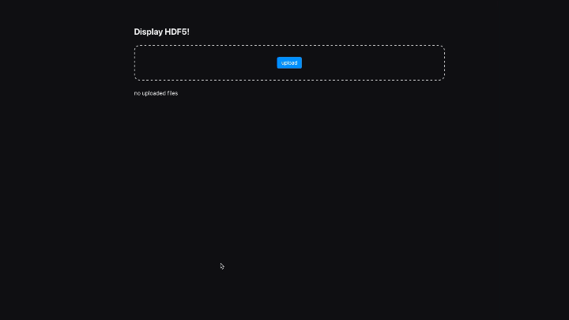

# HDF5 view

This tool aims to allow easy inspection of ```.hdf5``` files. In its most rudimentary cause it can already be used to view the file strucure
of any uploaded hdf5 file. In order to do so the tool will search the file recursivly for all ```Groups``` and ```Datasets``` and displays
them in tables for the user to select. For large file structures a search functionality will be added, which should make navigation a lot 
easier. Many files can be loaded in at the same time since they dont persist in memory but are loaded on demand. After the upload, files
can be selected from a list, which will redirect the user to the file content view. Here once again the different Groups can be selected
to see the Datasets inside.

> **NOTE:** Since this project originated from my need to view the contents of the GAMBIT output for my bachelor thesis, there is some 
> functionality specifically tailored to my peronal needs, which I hope to generalize in the future.
> At present though it. should also be possible to create 1D-histograms for arbitrary datasets given they have a flat shape.




- [ ] Implement pattern search for the file structure
- [ ] Implement other types of plots
- [ ] add support for more parameters/datasets
- [ ] make filtering the datasets accessible
- [ ] plot customization from the UI
